# 🧩 Microsserviços

A arquitetura de microsserviços é uma **abordagem** onde uma aplicação é composta por diversos **pequenos** serviços de **baixo acoplamento** e **independentes** de tecnologia, desenvolvimentno e deploy.

   

### 🔷 Principais características:
- **1. Independência**
    - Um microsserviço pode ser atualizado sem derrubar o resto do sistema.
    - Times diferentes podem trabalhar em serviços diferentes.
    - Tipos: (Banco, Time, Deploy)

- **2. Comunicação via rede**
    - REST, gRPC, eventos (Kafka, RabbitMQ, Azure Service Bus, etc.)
    - Comunicação síncrona (HTTP) ou assíncrona (eventos)

- **3. Banco por microsserviço**
    - Evita acoplamento
    - Cada serviço é dono dos seus dados
    - Integração acontece via APIs ou eventos, não via JOIN no banco

- **4. Deploy e escala independentes**
    - Serviço de pagamento pode escalar sem escalar o de catálogo
    - Ideal para containers (Docker + Kubernetes)

### 🤔 Quando usar microsserviços?
A primeira regra dos microsserviços é: **“Não crie microsserviços.”** Apesar de soar contraditório, o objetivo é lembrar que essa arquitetura só deve ser utilizada quando for, de fato, a abordagem mais adequada para resolver o problema.

**🟢 Faz sentido quando:**

- O monolito realmente não dá mais conta
- Seu produto precisa de um **"time to market"** muito curto
- Existem **muitas squads** entregando a mesma aplicação
- Sua aplicação exige **alta-disponibilidade**
- Necessidade de **escala diferenciada**
- Domínios de **negócio bem definidos**
- Necessidade de **várias tecnologias**
- **Deploys** muitas vezes por dia

**🔴 Geralmente não faz sentido:**
- O time não possui uma boa cultura de engenharia de software (SOLID, Design Patterns)
- O time não tem prática e cultura de testes
- O time não tem conhecimento de modelagem de software (DDD)
- O time não tem conhecimento de arquitetura de software
- O time não tem conhecimento de bancos NoSQL
- O time não possui a cultura de DevOps
- O time não possui conhecimento de orquestração / comunicação (REST, gRPC, filas, eventos)
- O time não possui conhecimentos de SRE (Observabilidade para resolver de problemas)
- O time não trabalha com cloud e containers (AKS, EKS, docker, k8s)
- Projetos pequenos
- Times muito reduzidos
- Quando ainda não se conhece bem o domínio

> **Regra prática:** comece monolito bem organizado. Extraia microsserviços quando a dor aparecer.

### ✅ Vantagens

- Escalabilidade independente
- Evolução mais rápida em times grandes
- Melhor isolamento de falhas
- Liberdade tecnológica (cada serviço pode usar stack diferente)
- Facilita domínio claro do negócio (DDD ajuda muito aqui)

### ❌ Desvantagens

- Complexidade maior
- Debug distribuído é mais difícil
- Latência de rede
- Consistência eventual
- Observabilidade vira obrigatória (logs, métricas, tracing)
- DevOps deixa de ser opcional

---

## 🏗️ Migrar Monolito para Microsserviços

A extração deve ser gradual, você vai tirando pedaços do monolito.

**Por isso o caminho mais saudável geralmente é:**
> Monolito → Monolito modular → Microsserviços

   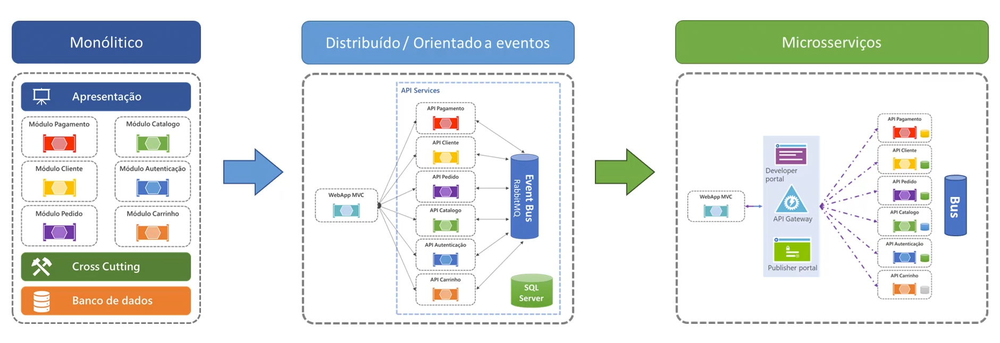

### 1️⃣ Monolito organizado (modular)

Antes de falar em microsserviço:

**Você precisa ter:**
- Camadas
- Separação de domínio
- Módulos claros

**Sem isso:**
→ você não sabe o que extrair

### 2️⃣ Identificar Bounded Contexts (DDD)

Aqui entra DDD forte.

**Pergunta chave:**

Quais partes do sistema mudam por motivos diferentes?

#### 📌 Exemplo:

- Usuários
- Clientes
- Catálogo
- Carrinho
- Pedidos
- Pagamentos

Cada um pode virar um serviço.

### 3️⃣ Isolar dependências internas

**Antes de extrair:**

- Remover acesso direto ao banco de outros módulos
- Criar interfaces
- Criar APIs internas

**Padrões usados:**

- Facade
- Anti-corruption layer
- Ports and Adapters (Hexagonal)

### 4️⃣ Extrair o primeiro microsserviço

**Regra prática:**
Comece pelo módulo menos crítico.

**Ou:**
- Alta mudança
- Alta carga
- Domínio bem isolado

**Exemplo clássico:**
- Notificações
- Autenticação
- Catálogo

### 5️⃣ Comunicação entre serviços

**Opções:**

**Síncrono**
REST
gRPC

**Assíncrono (preferido para desacoplamento)**
- Eventos
- Mensageria (RabbitMQ, Kafka, SQS, Service Bus)

### 📝 Resumo

**O caminho mais seguro:**

#### 🔷 Fase 1
- Monolito modular + DDD

#### 🔷 Fase 2

**Extrair:**
- Autenticação
- Notificação
- Integrações externas

#### 🔷 Fase 3
- Extrair domínios de alto crescimento

#### 🔷 Fase 4
- Event-driven architecture

---

## 📈 Timeline de Evolução do Tamanho de um Microsserviço

**A ideia central aqui é:**

> **Microsserviço não nasce pequeno. Ele nasce coeso.**
> O tamanho ideal aparece com o tempo, conforme o domínio amadurece.

### 🕐 Fase 0 — Entendimento do Domínio (DDD)

Antes de qualquer decisão técnica, entendemos o **negócio.**

**Bounded Contexts identificados**

   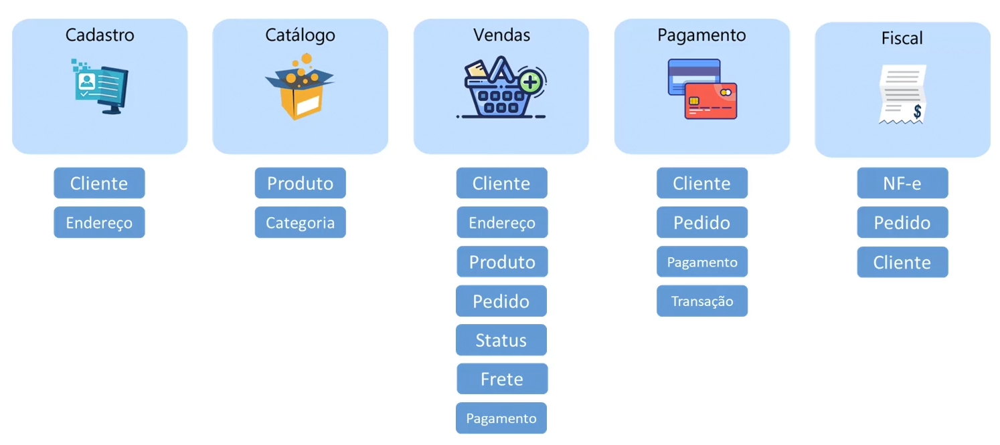

#### Contextos e entidades envolvidas:

   * **Cadastros**

      - Cliente
      - Endereço

   * **Catálogo**

      - Produto
      - Categoria

   * **Vendas**

      - Cliente
      - Endereço
      - Produto
      - Pedido
      - Status
      - Frete
      - Pagamento

   * **Pagamento**

      - Cliente
      - Pedido
      - Pagamento
      - Transação

   * **Fiscal**

      - NF-e
      - Pedido
      - Cliente

📌 **Aqui não existe microsserviço ainda.**

Só linguagem, fronteiras e responsabilidades claras.

### 🕐 Fase 1 — Microsserviços grandes, porém bem definidos

Primeira extração baseada diretamente nos bounded contexts.

   * **Microsserviços iniciais**

      - Pagamento
      - Catálogo
      - Cliente
      - Autenticação
      - Pedido
      - Carrinho

   * **Características dessa fase**

      - Serviços maiores
      - Mais entidades por serviço
      - Menos chamadas entre serviços
      - Menor complexidade operacional

   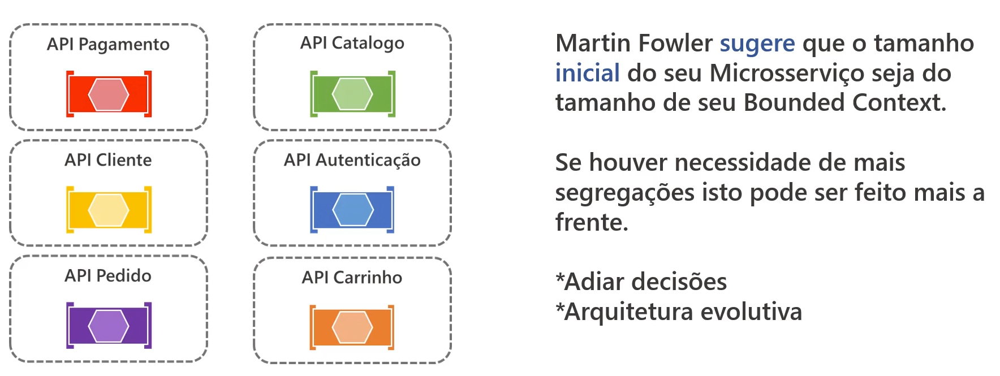

> 👉 **Isso é intencional.** \
> Estamos priorizando **estabilidade e aprendizado**, não granularidade extrema.

### 🕐 Fase 2 — Observação e sinais de crescimento

Com o sistema rodando em produção, começam a aparecer sinais claros:

**Sinais de que um serviço está “grande demais”**

No caso da **API de Pedido:**

- Muitas responsabilidades diferentes
- Deploy frequente quebra coisas não relacionadas
- Regras de negócio conflitantes
- Time pisa no mesmo código o tempo todo
- Métricas e escalabilidade diferentes

> 📌 Aqui o problema **não é tamanho de código**, é **motivos diferentes para mudar.**

### 🕐 Fase 3 — Evolução do microsserviço de Pedido

Agora sim, faz sentido **diminuir o microsserviço.**

> Não é fragmentação aleatória. \
> É **separação por responsabilidade de negócio.**

### 🔪 Quebra do microsserviço de Pedido

**Microsserviço original**

**Pedido**
- Criação
- Cancelamento
- Status
- Frete
- Integrações
- Regras fiscais
- Regras de pagamento

> 👉 Responsabilidade demais.

### 📝 Novo desenho

   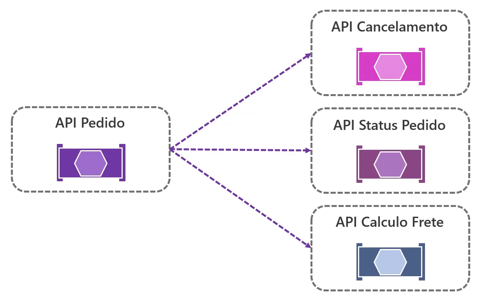

### 1️⃣ Cancelamento de Pedido

**Responsabilidade:** Gerenciar **regras e efeitos do cancelamento.**

**Exemplos de features**
- Cancelamento manual pelo cliente
- Cancelamento automático por timeout
- Cancelamento por falha de pagamento
- Reembolso parcial ou total
- Histórico de cancelamentos

**Principais preocupações**
- Idempotência (não cancelar duas vezes)
- Regras por status (pedido enviado não cancela)
- Integração com:
   -  Pagamento (estorno)
   -  Estoque (devolução)
- Auditoria e rastreabilidade
- Consistência eventual

### 2️⃣ Status do Pedido

**Responsabilidade:** Gerenciar o **ciclo de vida do pedido.**

**Exemplos de features**

   * Estados do pedido:
      - Criado
      - Pago
      - Separação
      - Enviado
      - Entregue
      - Cancelado

   * Timeline do pedido
   * Notificação por mudança de status
   * SLA por status

**Principais preocupações**
- Máquina de estados bem definida
- Eventos de domínio (OrderStatusChanged)
- Evitar transições inválidas
- Alta leitura (consultas)
- Observabilidade

### 3️⃣ Cálculo de Frete

**Responsabilidade:** Calcular preço e **prazo de entrega.**

**Exemplos de features**

- Cálculo por CEP
- Integração com transportadoras
- Regras promocionais de frete
- Frete grátis
- Simulação antes da compra

**Principais preocupações**
- Performance (muito chamado)
- Cache
- Timeout e fallback
- Integração externa instável
- Escalabilidade independente

**🧠 Regra de ouro sobre tamanho**

> O tamanho de um microsserviço não é medido em linhas de código. \
> É medido pela quantidade de motivos diferentes para mudar. 

---

## ⚒️ Padrões para evoluir monolito → microsserviços

Aqui estão os mais importantes na vida real:

### 🌿 1. Strangler Fig Pattern (o mais famoso)

#### Ideia:

O sistema novo vai **“estrangulando”** o antigo aos poucos.

#### 🧠 Como funciona:

1. Nova funcionalidade vai para um serviço novo
1. Rotas são redirecionadas
1. Parte antiga é removida

   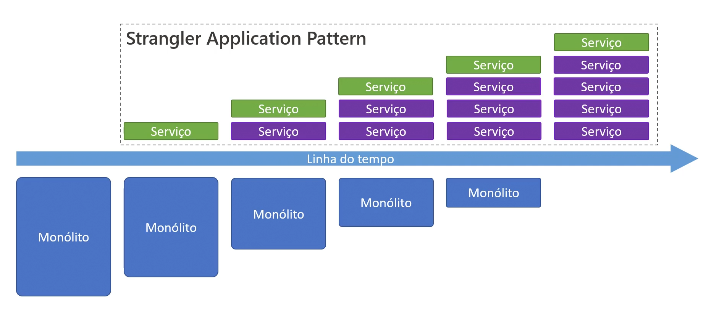

#### Muito usado com:

- API Gateway
- Reverse proxy

   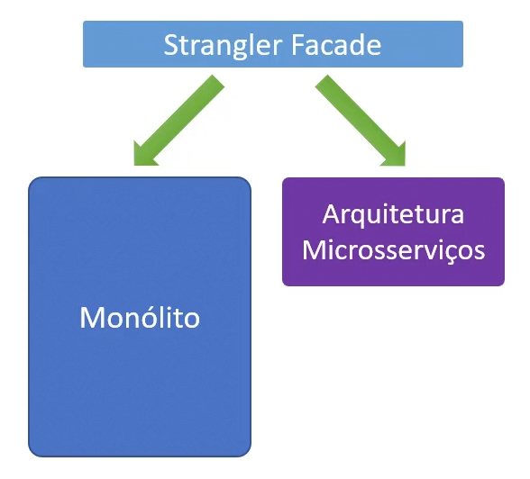

### 🔀 2. Branch by Abstraction

#### Você cria:

- Uma abstração
- Implementação antiga
- Implementação nova

Depois troca sem quebrar tudo.

#### Usado para:

- Migrar banco
- Migrar módulo interno
- Extrair serviço

   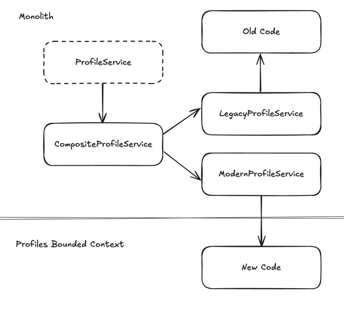

### 🚧 3. Anti-Corruption Layer

#### Serve para:

- Proteger o domínio novo do legado
- Traduzir modelos

#### Muito usado quando:

- Monolito tem modelo ruim
- Nome de entidades confuso

   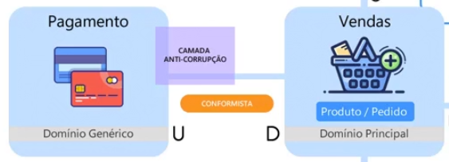

### 🚪 4. API Gateway

#### Centraliza:

- Autenticação
- Rate limit
- Roteamento
- Versionamento

   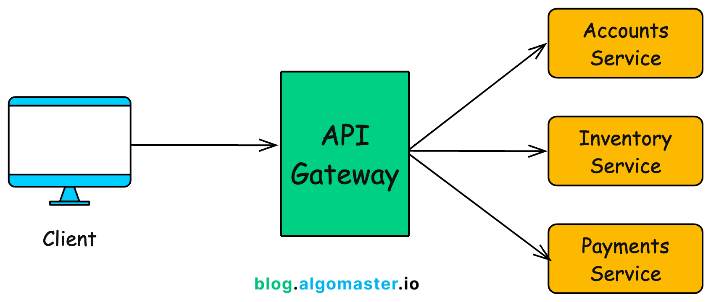

---

## 🗂️ Gerenciamento de Dados Distribuídos

Em microsserviços, um dos maiores desafios **é como os dados são armazenados, compartilhados e sincronizados** sem quebrar autonomia e escalabilidade.

#### Regra base:
> Um microsserviço é dono dos seus dados.

A partir disso, surgem padrões e estratégias.

### 🔺 Teorema CAP

O teorema CAP diz que, em um sistema distribuído, **não é possível garantir simultaneamente** as três propriedades abaixo:

- C – Consistência (Consistency)
- A – Disponibilidade (Availability)
- P – Tolerância a Partições (Partition Tolerance)

Você **sempre abre mão de uma delas.**

   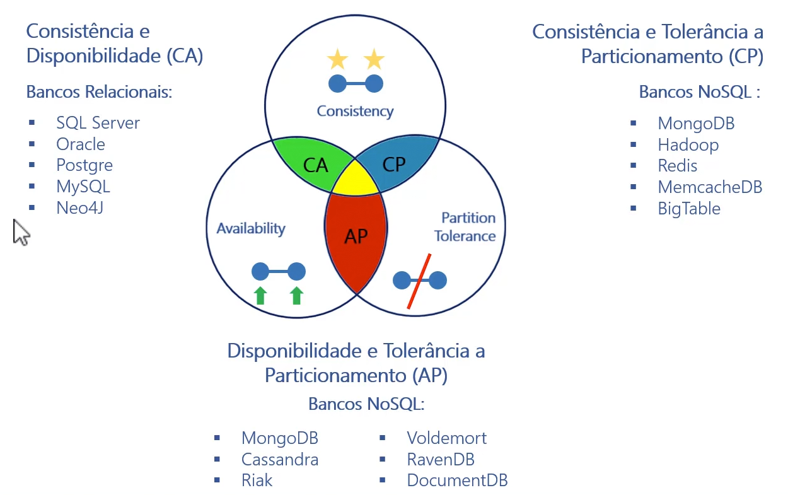

### 🔷 Consistência (C)

Todos os nós veem os mesmos dados ao mesmo tempo.

- Uma escrita é imediatamente visível para todas as leituras
- Não existe dado “desatualizado”

#### 📌 Exemplo:
Após atualizar o status de um pedido, qualquer serviço que consultar esse dado verá o novo status.

### 🔷 Disponibilidade (A)

O sistema **sempre responde**, mesmo que com erro ou dado antigo.

- Cada requisição recebe uma resposta válida
- O sistema não “trava”

#### 📌  Exemplo:
Mesmo com um nó fora do ar, a API continua respondendo.

### 🔷 Tolerância a Partições (P)

O sistema continua funcionando mesmo quando há falha de comunicação entre nós.

- Perda de rede
- Latência alta
- Nós isolados

📌 Em sistemas distribuídos reais, **P é obrigatório.**

### ⚠️ A verdade dura

Em um sistema distribuído:
> **Você sempre terá P.**

Então a escolha real é:

- **CP →** Consistência + Tolerância a Partições
- **AP →** Disponibilidade + Tolerância a Partições

**CA (Consistência + Disponibilidade)** só é possível **sem distribuição** (ex: monolito, banco único).

### 🔄 Combinações na prática

#### CA (Consistency + Availability)

O sistema garante:

- Consistência total dos dados
- Alta disponibilidade

Mas **somente quando não existe distribuição** (ou seja, sem tolerância a partições).

#### 📌 Exemplos:
- Um sistema monolítico
- Um único banco de dados relacional

#### CP (Consistency + Partition Tolerance)

O sistema prefere consistência.

- Se houver falha de rede → nega requisições
- Evita dados incorretos

#### 📌 Exemplos:

- Bancos relacionais distribuídos (em certos modos)
- Sistemas financeiros críticos

**Custo:** menor disponibilidade.

#### AP (Availability + Partition Tolerance)

O sistema prefere disponibilidade.

- Continua respondendo mesmo com partição
- Dados podem ficar temporariamente inconsistentes

#### 📌 Exemplos:

- Cassandra
- DynamoDB
- Muitos sistemas baseados em eventos

**Custo:** consistência eventual.

### 🧠 Regra de ouro

> CAP não é sobre escolher tecnologia. \
> É sobre **escolher comportamento diante de falhas.**

### 📝 Padrões e Estratégias

### 1️⃣ Shared Database

#### 📍 O que é

Vários microsserviços acessam o mesmo banco de dados.

   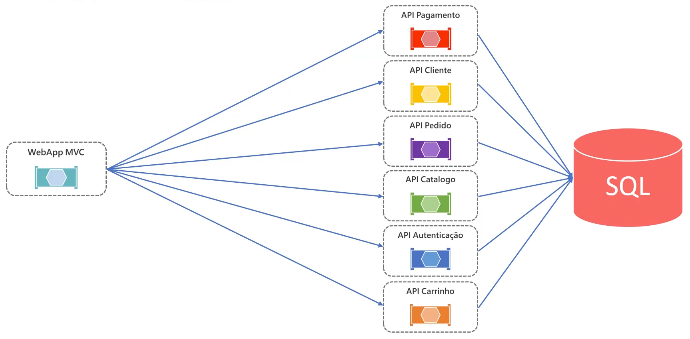

#### 📌 Quando aparece
- Migração de monolito
- Times pequenos
- Cenários temporários

#### ✅ Vantagens
- Simplicidade inicial
- JOINs fáceis
- Transações ACID globais

#### ❌ Desvantagens
- Alto acoplamento
- Deploy arriscado
- Evolução difícil
- **Anti-pattern** em microsserviços maduros

📌 Use apenas como **passo intermediário.**

### 2️⃣ Database Per Service

#### 📍 O que é

Cada microsserviço possui **seu próprio banco de dados.**

   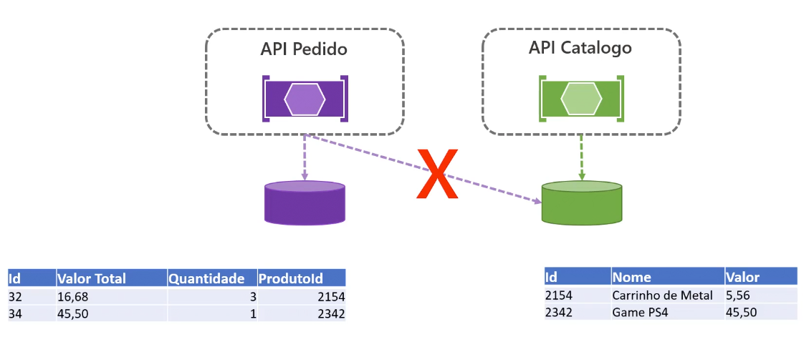

#### 🧠 Como funciona
- Serviço é dono do schema
- Outros serviços não acessam diretamente o banco

#### ✅ Vantagens
- Autonomia total
- Deploy independente
- Escalabilidade
- Liberdade tecnológica

#### 📍 Desafios
- Dados duplicados
- Consistência eventual
- Queries distribuídas

📌 É o **padrão mais importante** em microsserviços.

### 3️⃣ Como isolar bases e compartilhar dados entre serviços?

Existem **3 estratégias principais:**

#### 🔷 Chamada síncrona (API)

- REST / gRPC
- Simples
- Acoplamento temporal

#### 🔷 Eventos

- Serviço publica eventos
- Outros serviços mantêm cópias locais
- Consistência eventual

#### 🔷 BFF / API Gateway

- Orquestra chamadas
- Agrega dados
- Evita múltiplas chamadas do frontend

### 4️⃣ CQRS (Command Query Responsibility Segregation)

   

#### 📍 O que é
Separação entre:

* Command → escrita
* Query → leitura

   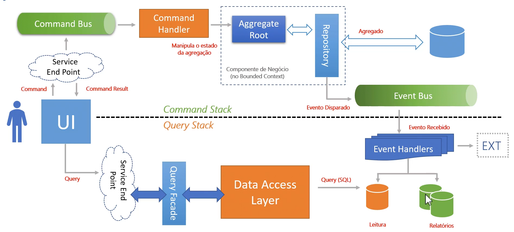

#### 📊 Benefícios

- Modelos de leitura otimizados
- Escalabilidade independente
- Facilita cache

#### 🤔 Quando usar

- Sistemas com muitas leituras
- Queries complexas
- Alta performance

📌 Muito usado com eventos.

### 5️⃣ BFF / API Gateway
#### 📍 O que é

Camada intermediária entre frontend e microsserviços.

   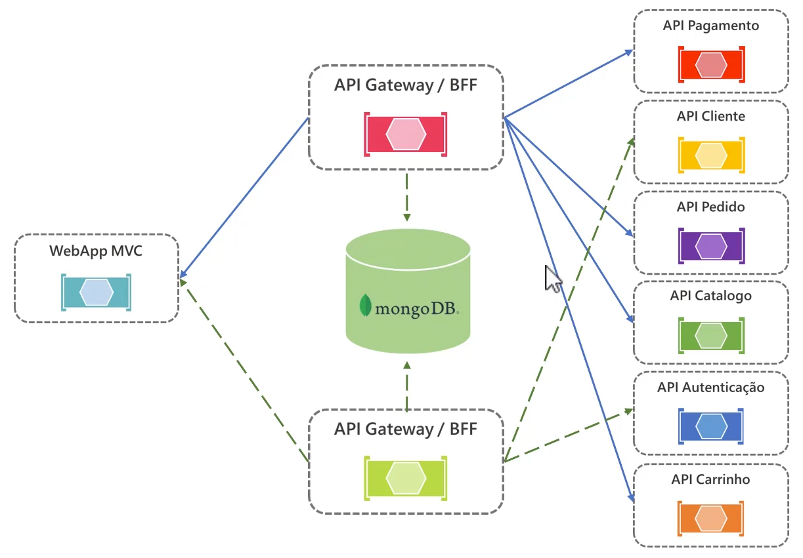

#### 📝 Papel nos dados

- Agrega dados de vários serviços
- Orquestra chamadas
- Aplica regras de apresentação

#### 📊 Benefícios

- Frontend mais simples
- Menos round-trips
- Melhor controle de contratos

📌 **Não deve conter regra de negócio core.**

### 6️⃣ Event Sourcing

   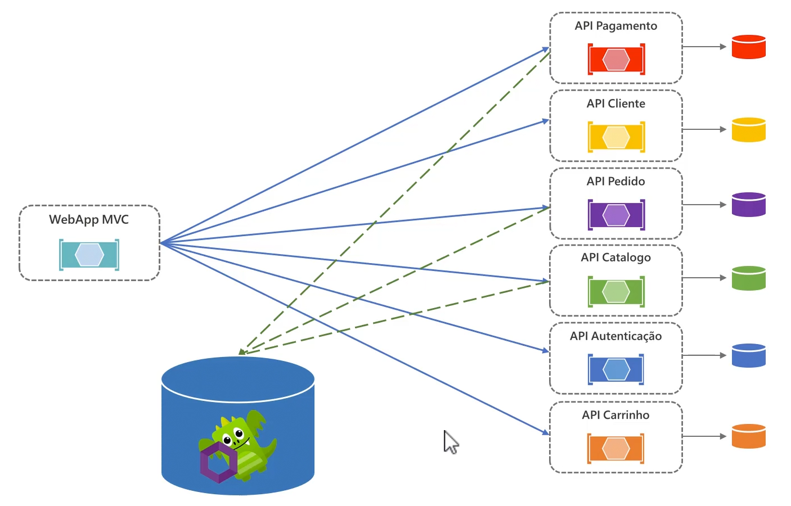

#### 📍 O que é

O estado não é armazenado diretamente.
Você guarda eventos.

#### 📌 Exemplo:
- PedidoCriado
- PagamentoAprovado
- PedidoCancelado

O estado atual é reconstruído a partir desses eventos.

   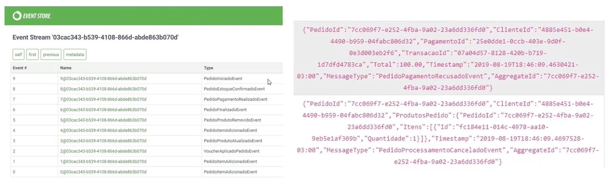

#### 📸 Snapshot no Event Sourcing

**Snapshot** é uma “foto” do **estado atual** de uma entidade em um determinado momento.

   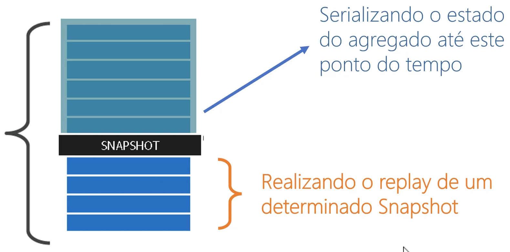

No Event Sourcing, o estado é reconstruído lendo todos os eventos desde o início.
Com o snapshot, o sistema:
1. Carrega o último snapshot
1. Processa apenas os eventos que vieram depois

#### 🧠 Por que usar?
- Evitar reprocessar centenas/milhares de eventos
- Melhorar performance
- Reduzir tempo de carregamento

#### 📌 Exemplo:

Pedido com 1000 eventos:
- Sem snapshot → lê 1000
- Com snapshot no 950 → lê só 50

#### 📝 Resumo:
Snapshot é um cache persistido do estado atual para acelerar a reconstrução no Event Sourcing.

#### ✅ Vantagens
- Histórico completo
- Auditoria nativa
- Integração natural com eventos

#### ❌ Desvantagens
- Complexidade
- Curva de aprendizado
- Reprocessamento

📌 Use apenas quando o domínio **realmente exige.**

### 7️⃣ Saga Pattern

O **Padrão Saga** é um padrão de design usado em arquiteturas de microsserviços para **gerenciar transações distribuídas e de longa duração**, garantindo a consistência dos dados em vários serviços independentes. Ele alcança isso por meio de uma sequência de transações locais e ações de compensação em caso de falha, em vez de depender de rollbacks tradicionais de banco de dados.

   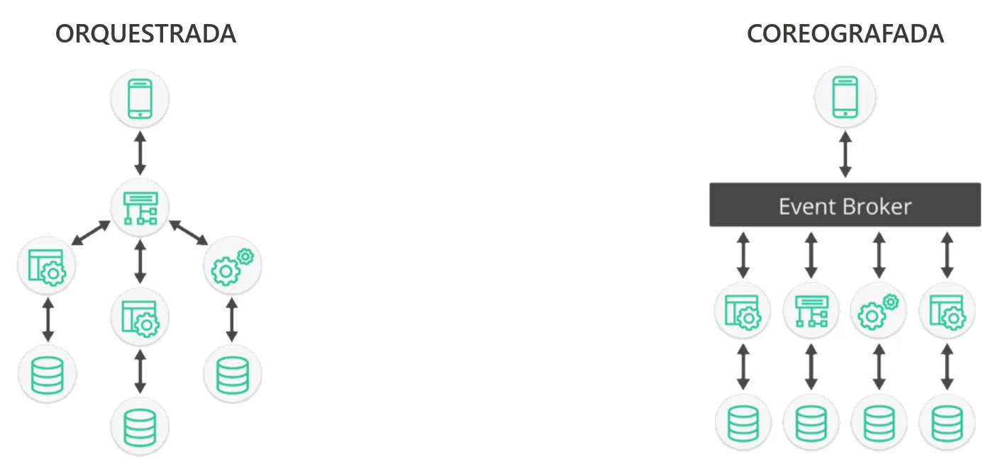

#### 📊 Resolve:
- Transações distribuídas

#### 📍 Dois tipos:
- Orquestrado
- Coreografado (eventos)

### 🎭 Saga Orquestrada
#### 📍 O que é

Existe um **orquestrador central** que:

- controla o fluxo
- decide o próximo passo
- trata falhas
- dispara compensações

Os serviços **não sabem o fluxo completo**, apenas executam comandos.

#### 🧠 Como funciona

1. **Orquestrador de Pedido**
   - envia comando `CriarPedido`

2. **Pagamento**
   - processa pagamento
   - responde `PagamentoAprovado` ou `PagamentoRecusado`

3. **Catálogo**
   - baixa estoque

4. **Pedido**
   - confirma pedido para entrega

**Em caso de falha**

* Orquestrador chama:
   - `EstornarPagamento`
   - `ReverterEstoque`
   - `CancelarPedido`

   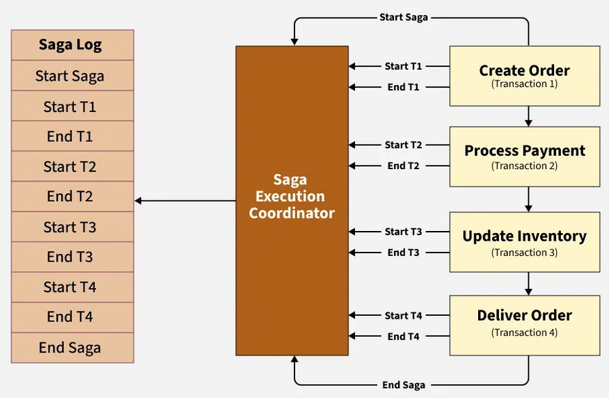

### 🎶 Saga Coreografada
#### 📍 O que é

Não existe orquestrador.

#### Cada serviço:
- reage a eventos
- executa sua parte
- publica novos eventos

👉 O fluxo **emerge** dos eventos.

#### 🧠 Como funciona

1. **Pedido**
   - cria pedido
   - publica `PedidoCriado`

2. **Pagamento**
   - escuta `PedidoCriado`
   - processa pagamento
   - publica `PagamentoAprovado`

3. **Catálogo**
   - escuta `PagamentoAprovado`
   - baixa estoque
   - publica `EstoqueBaixado`

4. **Pedido**
   - escuta `EstoqueBaixado`
   - confirma pedido para entrega

**Em caso de falha:**
- Serviço publica evento de falha
- Outros serviços reagem e compensam

   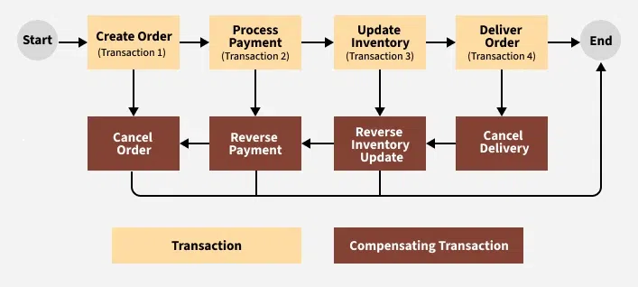

### 8️⃣ Cold Data

   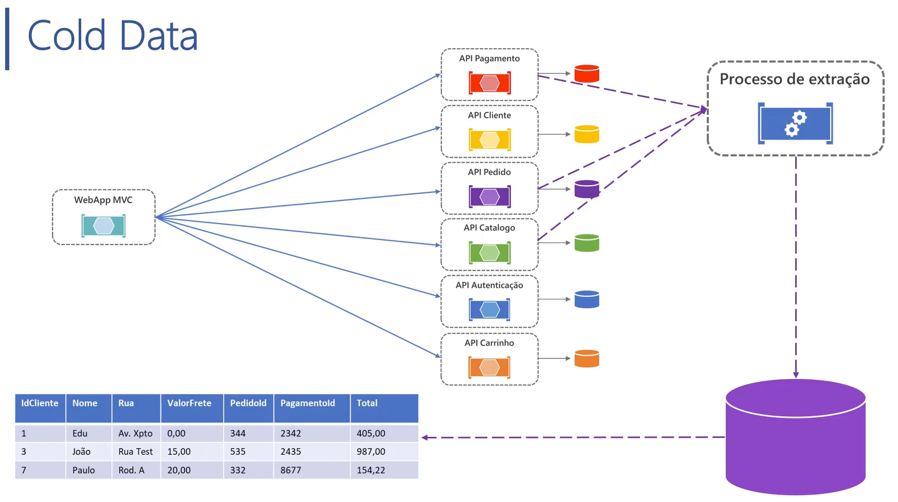

#### 📍 O que é

Dados que:
- não são acessados com frequência
- precisam ser mantidos por histórico ou compliance

#### 🎯 Estratégias
- Arquivamento
- Data Lake
- Storage barato (Blob, S3, etc.)
- Read-only

#### 📊 Benefícios
- Menor custo
- Bancos principais mais rápidos
- Melhor performance geral

#### 📌 Muito comum em:
- Pedidos antigos
- Logs
- Eventos históricos

### 🧠 Estratégia madura (resumo)

| Cenário                 | Estratégia                   |
| ----------------------- | ---------------------------- |
| Início                  | Shared Database (temporário) |
| Crescimento             | Database per Service         |
| Muitas leituras         | CQRS                         |
| Integração              | Eventos                      |
| Frontend complexo       | BFF                          |
| Histórico forte         | Event Sourcing               |
| Transações distribuídas | Saga                         |
| Dados antigos           | Cold Data                    |

---

## 🔁 Alta Disponibilidade e Resiliência 

### 🟢 Alta Disponibilidade (HA) 

Alta Disponibilidade é a **capacidade de um sistema continuar acessível mesmo quando ocorrem falhas.**

#### 🎯 Objetivo:
> Manter o serviço disponível pelo maior tempo possível.

#### 📊 Métricas comuns:
- SLA (99.9%, 99.99%, 99.999%)
- Tempo de indisponibilidade anual

#### 📌  Exemplo:
Um e-commerce não pode ficar fora do ar durante uma promoção.

### ♻️ Resiliência 

Resiliência é a capacidade do sistema de:
> **Absorver falhas, se adaptar e se recuperar rapidamente.**

#### 🔄 Um sistema resiliente:
- Não depende de um único ponto de falha
- Continua operando mesmo com degradação
- Se recupera automaticamente

### 🏛️ Pilares

#### 🛡️ 1. Tolerância a Falhas 
Capacidade do sistema de **continuar funcionando mesmo quando algo quebra.**

#### 📌 Exemplo:
- Retry automático
- Circuit Breaker
- Failover
- Fallback

#### ⚡ 2. Performance 
Capacidade de processar altas demandas de operações sem baixar a qualidade do tempo de entrega da informção processada.

#### Estratégias:
- Cache
- Processamento assíncrono
- Filas
- Otimização de consultas
- Read replicas

#### 📈 3. Escalabilidade 
Capacidade de crescer conforme aumenta a demanda.

#### Tipos:
- Vertical (mais CPU/RAM)
- Horizontal (mais instâncias)

#### Muito comum em:
- Kubernetes
- Cloud
- Microsserviços

### 📜 Princípios

### 🏎 Fail Fast and Independently

   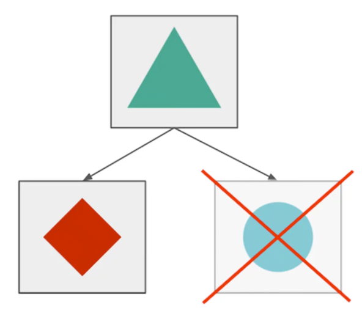

#### 📌 Falhar rápido e de forma independente significa:

- Detectar falhas o quanto antes
- Não “segurar” recursos esperando algo que não vai responder
- Evitar que uma falha se espalhe para outros serviços

#### 📊 Benefício:
Menos efeito cascata e recuperação mais rápida.

### 🔄 Change Management 

Cerca de 70% dos problemas em produção são causados por mudanças. Então quando você sobe uma nova versão de uma aplicação, você pode estar também introduzindo um novo bug.

Para minimizar esse problema você pode implementar uma estratégia conhecida como **"automatic rollouts"**

A ideia é subir a versão gradaticamente em suas instâncias, caso o monitoramento identifique erros um **"rollout"** é executado.

   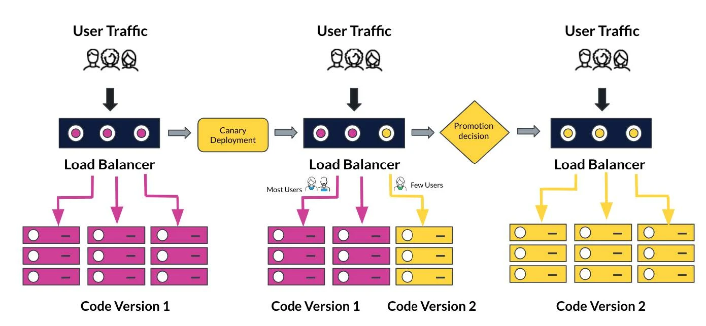

#### 📝 Práticas para gerenciamento de mudanças para evoluir sistemas sem indisponibilidade:

- 🎚️ Feature Toggle
- 🔵🟢 Blue/Green Deployment
- 🐤 Canary Release
- 📦 Versionamento de APIs

#### 🎯 Objetivo:
> Mudar com segurança, sem quebrar produção.

### 📝 Padrões e Estratégias

### ❤️ Health Check
É basicamente uma funcionalidade de uma API que monitora serviços essenciais para o próprio funcionamento.

   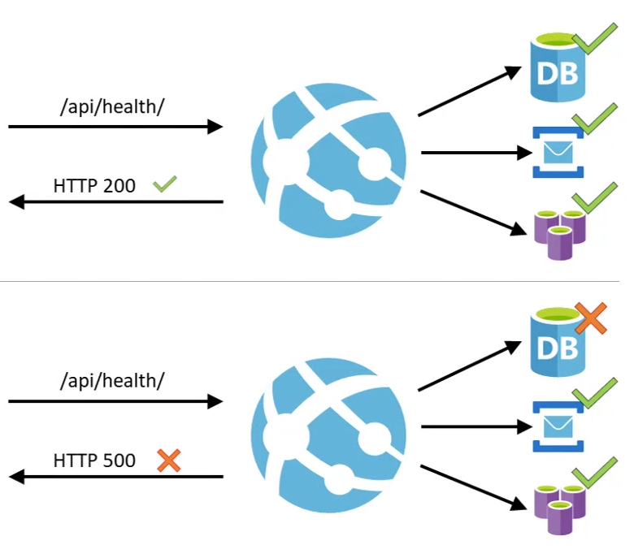

#### 📦 Dependências
- Cache
- Banco de dados
- Fila

#### 📍 Usado por:
- Kubernetes
- Load balancers

#### 🎯 Objetivo
> Monitora se o serviço está saudável.

### ⚖️ Load Balancer 
Distribui requisições entre várias instâncias. Essas ferramentas oferecem recursos avançados, como alta disponibilidade, escalabilidade automática e proteção contra ataques DDoS.

   

#### 📌 Plataformas:
- Microsoft Azure Load Balancer
- Amazon Elastic Load Balancer (ELB)
- Google Cloud Load Balancing
- Nginx
- HAProxy

#### ✅ Garante:
- Alta disponibilidade
- Melhor uso de recursos

### 🖥🖥 Redundância

Manter **componentes duplicados** para eliminar pontos únicos de falha.

   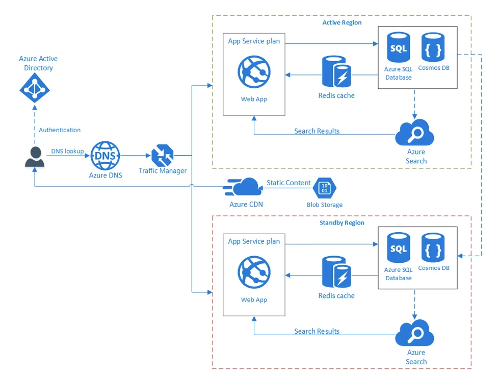

#### 📌 Exemplo:
- Múltiplas instâncias de serviço
- Bancos com réplica
- Multi-Zone / Multi-Region 🌍

#### 📊 Resultado:
Se um falha, outro assume.

### 🚦 Throttling Pattern

É a técnica de **limitar a quantidade de requisições** que um sistema aceita/processa em determinado período.

   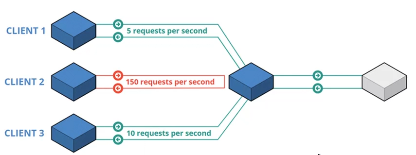

#### Usado para:
- Proteger serviços de sobrecarga
- Evitar abuso
- Garantir qualidade para todos

#### Onde aplicar:
- API Gateway
- BFF
- API
- Banco de dados
- Hardware (Consumo de CPU/Memória)

#### 🔧 Técnicas de Throttling

#### 1️⃣ Rate Limiting (Limite por tempo)

Limita requisições por período.

#### 📌 Exemplo:
- 100 requisições por minuto por usuário
- 1000 requisições por minuto por IP

#### 🧬 Algoritmos comuns:
#### 🔹 Fixed Window

Conta requisições dentro de uma janela fixa. \
Simples, mas pode gerar picos no limite da janela.

#### 🔹 Sliding Window

Mais preciso, evita picos artificiais.

#### 🔹 Token Bucket

Usuário recebe "tokens" por tempo. \
Cada requisição consome 1 token.

Permite pequenos bursts.

#### 🔹 Leaky Bucket

Requisições entram em uma fila e saem em ritmo constante. \
Excelente para suavizar picos.

#### 2️⃣ Concurrency Limiting (Limite de concorrência)

Limita quantas requisições podem estar processando simultaneamente.

#### 📌 Exemplo:
- Máximo 50 requisições concorrentes no serviço de pagamento.

#### Muito usado para:
- Serviços pesados
- Processos CPU-intensive

#### 3️⃣ Quotas por Cliente

#### Define limites diferentes por perfil:
- Free → 100 req/min
- Premium → 1000 req/min

Muito comum em APIs públicas.

#### 4️⃣ Throttling baseado em prioridade

#### Permite priorizar:

- Checkout > Consulta de catálogo
- Pagamento > Relatórios

Evita que requisições menos críticas afetem o core do negócio.

#### 5️⃣ Backpressure (controle de pressão)

Muito usado em sistemas reativos.

#### Quando o consumidor está lento:
- Produtor desacelera
- Ou começa a rejeitar mensagens

#### Comum em:
- Kafka
- Sistemas reativos

### 🤖 Self-Healing 

Capacidade do sistema de **se recuperar automaticamente.**

   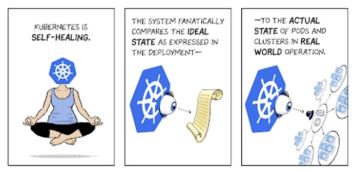

#### 📌 Exemplo:
- Restart automático de pods
- Recriação de instâncias
- Health checks
- Restaurar configuração
- Rollback de versão

#### 📋 Muito comum em:
- Kubernetes
- Cloud-native apps

### 📤 Failover Caching
É uma estratégia de usar dados previamente armazenados em cache quando um serviço dependente falha.

   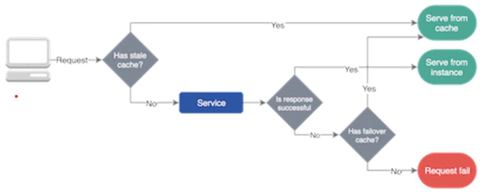

#### 🎯 Objetivo
- Manter o sistema disponível
- Evitar erro para o usuário
- Permitir degradação controlada

#### 📋 Tipos de Cache Usados
- In-memory (rápido, mas local)
- Redis (distribuído)
- CDN (para conteúdo público)
- Cache em API Gateway

#### 🧠 Como funciona
- Serviço consulta uma dependência
- Armazena resposta em cache
- Se a dependência falhar → retorna o dado do cache

#### 📌 Exemplo:
Se o serviço de estoque cair, o catálogo pode exibir a última informação conhecida em vez de quebrar a aplicação.

#### 📍 Geralmente combinado com:
- Circuit Breaker
- Retry 
- Timeout

#### ⚠️ Atenção
- Retorne dados desatualizados quando **são melhores do que nada**
- Precisa de boa estratégia de expiração (TTL)

#### 📝 Resumo final:
É uma técnica de resiliência que permite continuar operando mesmo quando dependências estão indisponíveis.

### 🧼 Stateless Services 

Serviços que **não mantêm estado local** entre requisições, é um padrão de arquitetura que consiste em projetar serviços que não armazenam dados do estado da sessão do usuário.

Em outras palavras, cada solicitação de um usuário é tratada de forma independente, sem que o serviço mantenha informações sobre sessões anteriores.

   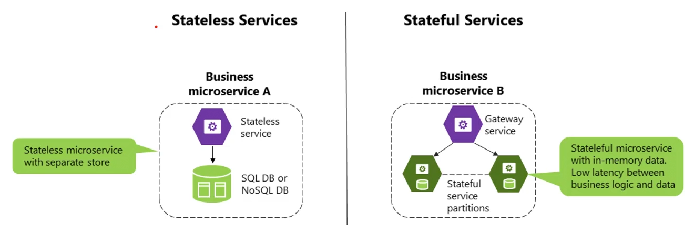

#### 📍 Estado fica em:
- Banco de dados
- Cache distribuído
- Mensageria

#### 📊 Benefícios
- Escala horizontal fácil
- Failover simples
- Menos acoplamento

### 🔄 Compensating Transactions

**Compensating Transactions** são ações usadas para **desfazer ou neutralizar efeitos de uma operação já executada**, principalmente em sistemas distribuídos.

Elas são muito comuns em arquiteturas com **microsserviços** e no padrão **Saga**.

   

#### 🤔 Por que existem?

Em sistemas distribuídos:
- Não há transação distribuída tradicional (ACID global)
- Cada serviço tem seu próprio banco
- Se uma etapa falhar, as anteriores já podem ter sido confirmadas

Então, em vez de **“rollback automático”**, usamos:
> Uma nova ação que compensa o que já foi feito.

#### 🛒 Exemplo no e-commerce

#### Fluxo de pedido:

- 🧾 Pedido criado
- 📦 Estoque reservado
- 💳 Pagamento processado
- 🚚 Envio solicitado

Se o pagamento falhar após reservar o estoque:

* Executa compensação:
   - ❌ Cancela pedido
   - 🔁 Libera estoque

Cada serviço executa sua própria compensação.

#### 📍 Características

- Não é rollback de banco
- É uma nova operação de negócio
- Deve ser idempotente
- Pode ser assíncrona

#### ⚠️ Pontos importantes

- Compensação pode falhar também
- Nem toda operação é totalmente reversível
- Pode haver inconsistência temporária (consistência eventual)

#### 📌 Onde é usado?
- Saga Coreografada
- Saga Orquestrada
- Processos de negócio distribuídos
- Sistemas financeiros

#### 📝 Resumo

Em sistemas distribuídos:
- Se não dá para fazer rollback global,
- você faz uma nova ação para compensar o que já foi feito.
- É a base para manter consistência em arquiteturas modernas.

### 🗘 Retry Pattern
O **Retry Pattern** é um padrão de resiliência que consiste em **tentar novamente uma operação que falhou**, assumindo que a falha pode ser temporária.

   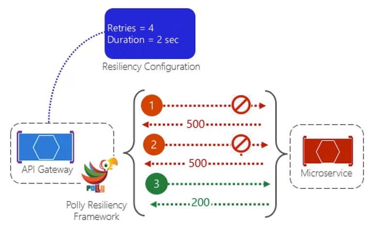

#### 🤔 Quando usar?

Quando a falha é **transiente**, por exemplo:
- Timeout ⏱️
- Pico momentâneo de carga
- Falha temporária de rede 🌐
- Serviço iniciando

#### 🎯 Objetivo
- Aumentar taxa de sucesso
- Melhorar robustez
- Reduzir impacto de falhas intermitentes

#### 🔄 Como funciona
Se uma chamada falhar:
1. Aguarda um pequeno intervalo
1. Tenta novamente
1. Repete até atingir o limite configurado

#### 📌 Estratégias comuns

#### 🔷 Retry Simples

- Tenta novamente imediatamente.

#### 🔷 Retry com Delay

- Aguarda alguns milissegundos antes de tentar novamente.

#### 🔷 Exponential Backoff

Aumenta o tempo de espera a cada tentativa:

- 1ª tentativa → 200ms
- 2ª → 400ms
- 3ª → 800ms

Evita avalanche de requisições.

#### 🔷 Retry com Jitter

Adiciona variação aleatória no tempo de espera para evitar que várias instâncias tentem ao mesmo tempo.

Muito usado em produção.

#### 🛒 Exemplo no e-commerce

Serviço de **Pedido** chama **Pagamento**:

- Primeira tentativa falha (timeout)
- Retry tenta novamente
- Segunda tentativa funciona

Sem retry → pedido falharia desnecessariamente.

#### ⚠️ Cuidados
- Não usar para erros definitivos (ex: 400 Bad Request)
- Definir limite de tentativas
- Combinar com Circuit Breaker 🔌
- Evitar retry infinito

#### 📝 Resumo

#### Retry é uma técnica que:
- Tenta novamente operações que falharam temporariamente, aumentando a resiliência do sistema.
- Mas deve ser usado com estratégia (backoff + limite), senão pode piorar o problema.

### 🔌 Circuit Breaker

O **Circuit Breaker** é um padrão de resiliência que evita que um sistema continue chamando um serviço que está falhando.

   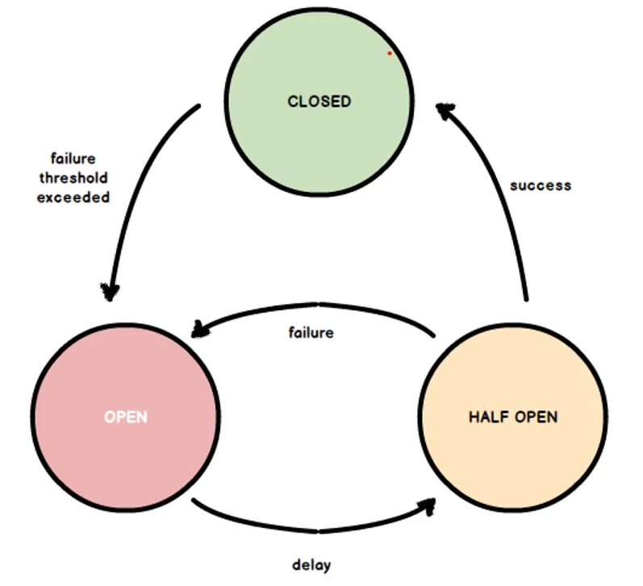

#### 🧠 Como funciona

Ele possui 3 estados:
- 🟢 **Closed (Fechado):** chamadas funcionando normalmente
- 🔴 **Open (Aberto):** falhas atingiram o limite, chamadas são bloqueadas imediatamente
- 🟡 **Half-Open (Semiaberto):** testa algumas chamadas para verificar se o serviço se recuperou

#### 🎯 Objetivo
- Evitar efeito cascata
- Proteger recursos
- Melhorar estabilidade do sistema

#### 📌 Exemplo:
Se o serviço de pagamento começa a falhar:
- O Circuit Breaker abre
- O sistema para de chamar o pagamento
- Pode retornar fallback ou usar cache

#### 📝 Resumo final:
Circuit Breaker é um mecanismo que **interrompe chamadas para serviços instáveis**, permitindo recuperação controlada e evitando colapso do sistema.

### 🚢 Bulkhead Pattern
O **Bulkhead Pattern** consiste em **isolar recursos** para que a falha de uma parte do sistema não afete o restante.

   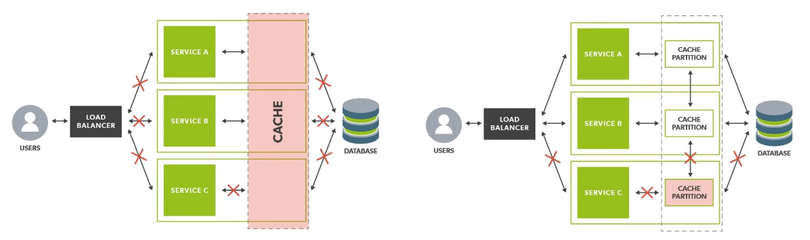

O nome vem de navios 🚢, que possuem compartimentos isolados:
se um compartimento alaga, o navio não afunda.

   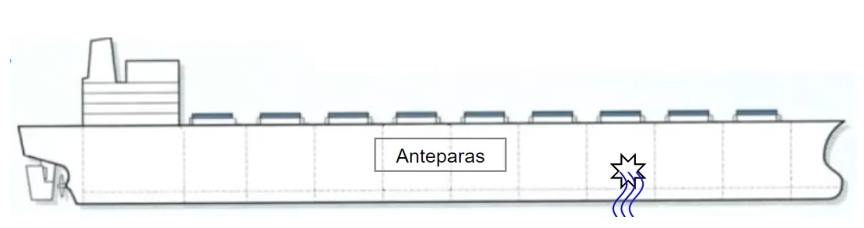

#### 🧠 Como aplicar:
- Pool de conexões separado por serviço
- Threads isoladas por tipo de operação
- Limite de concorrência por recurso
- Filas independentes

#### 🎯 Objetivo:
Evitar efeito cascata e manter o sistema parcialmente funcional.

### 🌪️ Chaos Engineering
**Chaos Engineering** é a prática de **introduzir falhas controladas em produção ou ambientes de teste** para validar a resiliência do sistema.

#### 🤔 Em vez de perguntar:
> “E se o banco cair?”

Você testa derrubando ele controladamente.

#### 📌 Exemplos
- Derrubar instâncias
- Simular latência
- Interromper conexão com banco
- Induzir falhas de rede

#### 🛠️ Ferramentas
- Chaos Monkey
- Litmus
- Gremlin

#### 🎯 Objetivo
- Validar se o sistema realmente é resiliente, não só no papel.
- Descobrir fraquezas antes que elas causem incidentes reais.

### ☸️ Kubernetes

Kubernetes (também chamado de k8s) é uma **plataforma open source para orquestração de contêineres**. Ele foi originalmente desenvolvido pelo **Google** e hoje é mantido pela **Cloud Native Computing Foundation (CNCF).**

Ele ajuda a implantar, escalar e **gerenciar aplicações em contêineres** (como os criados com Docker) de forma automática e eficiente.

   

#### 🔧 Funcionalidade Principais

1. **Orquestra contêineres:** decide onde e como os contêineres devem rodar.
1. **Implantação automática e rollback:** gerencia a implantação e a atualização dos seus aplicativos sem downtime.
1. **Escalabilidade automática:** aumenta ou reduz a quantidade de réplicas da aplicação conforme a carga.
1. **Distribuição de carga:** balanceia o tráfego entre os contêineres.
1. **Autocorreção:** substitui ou reinicia contêineres com problemas automaticamente.

#### 🌥️ Principais provedores e suas implementações Kubernetes

   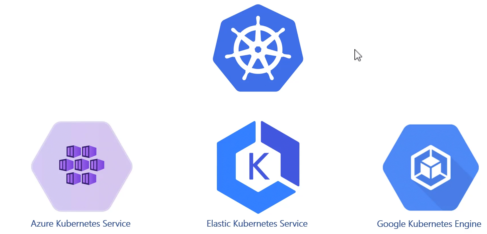

#### 🌩️ Sabores de k8s
| Provedor                        | Nome do Serviço Kubernetes                     | Sigla     |
| ------------------------------- | ---------------------------------------------- | --------- |
| **Amazon Web Services (AWS)**   | Elastic Kubernetes Service                     | **EKS**   |
| **Microsoft Azure**             | Azure Kubernetes Service                       | **AKS**   |
| **Google Cloud Platform (GCP)** | Google Kubernetes Engine                       | **GKE**   |
| **IBM Cloud**                   | IBM Kubernetes Service                         | **IKS**   |
| **Oracle Cloud**                | Oracle Container Engine for Kubernetes         | **OKE**   |
| **Alibaba Cloud**               | Alibaba Cloud Container Service for Kubernetes | **ACK**   |
| **DigitalOcean**                | DigitalOcean Kubernetes                        | **DOKS**  |
| **Linode (Akamai Cloud)**       | Linode Kubernetes Engine                       | **LKE**   |

---

## 🕵🏻 Observabilidade

Observabilidade é a capacidade de **entender o que está acontecendo dentro do sistema analisando seus outputs externos.**

Em sistemas distribuídos, você não debuga mais com breakpoint, você observa comportamento em produção.

#### Ela é baseada em 3 pilares:
- 📜 Logs
- 📊 Métricas
- 🔗 Tracing

### 📜 1. Logs

Registros detalhados de eventos que aconteceram no sistema.

   

#### 🧠 Usados para:
- Investigar erros
- Entender fluxo de execução
- Auditoria

#### 📌 Boas práticas:
- Log estruturado (JSON)
- Incluir CorrelationId
- Níveis de log (Info, Warning, Error, Critical)
- Evitar logar dados sensíveis

#### 🔧 Ferramentas comuns:
- Serilog
- ELK Stack (Elasticsearch + Logstash + Kibana)
- Datadog
- Loki

### 📊 2. Métricas

**Estatísticas quantificáveis** que descrevem o **desempenho** e o **comportamento** do sistema.

   

#### 📍 Exemplos:
- Latência média
- Taxa de erro
- Requisições por segundo
- Uso de CPU

#### 🧠 Usadas para:
- Monitoramento
- Alertas
- SLA/SLO

#### 📌 Tipos de métricas:
- Counter → total acumulado
- Gauge → valor atual
- Histogram → distribuição
- Summary → estatísticas

#### 🔧 Ferramentas:
- Prometheus
- Grafana
- Azure Monitor
- CloudWatch

### 🔗 3. Distributed Tracing

É uma **técnica para monitorar** o **fluxo das solicitações**, permitindo acompanhar o **caminho** de uma requisição **atravessando múltiplos microsserviços.**

   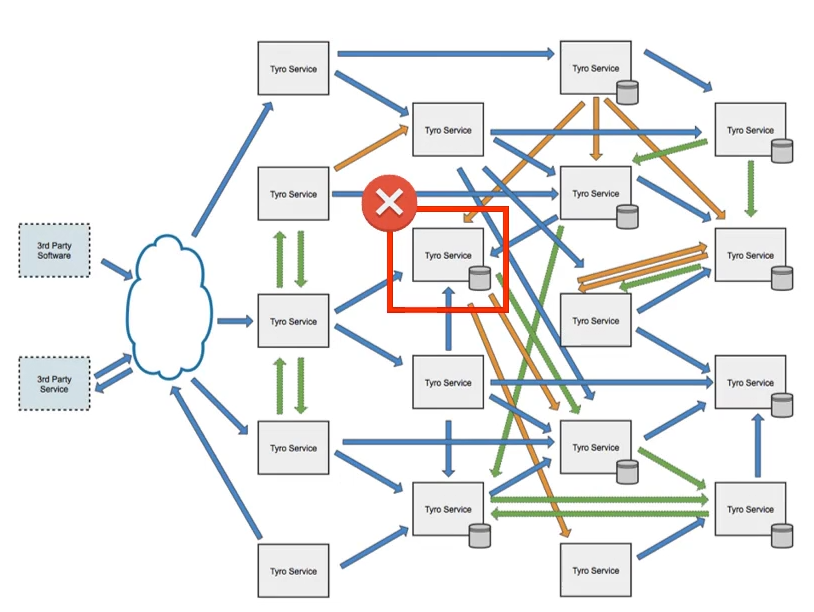

#### Exemplo:
Cliente → API Gateway → Pedido → Pagamento → Estoque

#### Tracing mostra:
- Tempo em cada serviço
- Onde ocorreu falha
- Gargalos

#### 🧠 Conceitos importantes:
- TraceId
- SpanId
- CorrelationId

#### 🔧 Ferramentas:
- OpenTelemetry
- Jaeger
- Zipkin
- Application Insights

### 📝 Resumo Final
| Pilar       | Responde              |
| ----------- | --------------------- |
| 📜 Logs     | O que aconteceu?      |
| 📊 Métricas | Está saudável?        |
| 🔗 Tracing  | Onde está o problema? |

### 🚗 O que é o Sidecar Pattern?

O Sidecar Pattern consiste em executar um **componente auxiliar junto com o serviço principal**, normalmente no mesmo ambiente (ex: mesmo Pod no Kubernetes).

Ele funciona como um **“companheiro”** do serviço principal, cuidando de responsabilidades transversais.

> O serviço foca na regra de negócio \
> O sidecar cuida da infraestrutura

   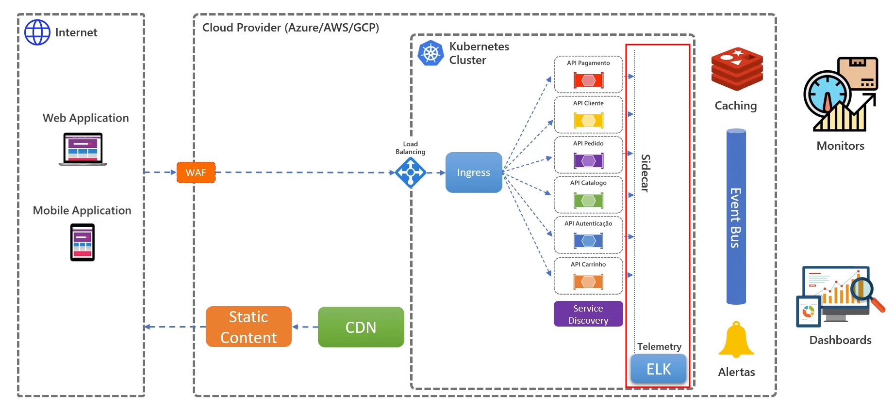

### 🤔 Por que usar?

Em microsserviços, muitas preocupações se repetem:

- 📜 Logs
- 🔐 Segurança
- 🔑 Comunicação segura (mTLS)
- 📊 Observabilidade
- 🔁 Retry / Circuit Breaker
- 🌐 Proxy / Networking

Em vez de colocar tudo dentro da aplicação, você externaliza isso para um sidecar.

### 🏗️ Como funciona (no Kubernetes)

#### Um Pod pode ter:
- Container principal (sua API)
- Container sidecar (ex: proxy, coletor de logs)

#### Eles compartilham:
- Rede (localhost)
- Volume
- Ciclo de vida

   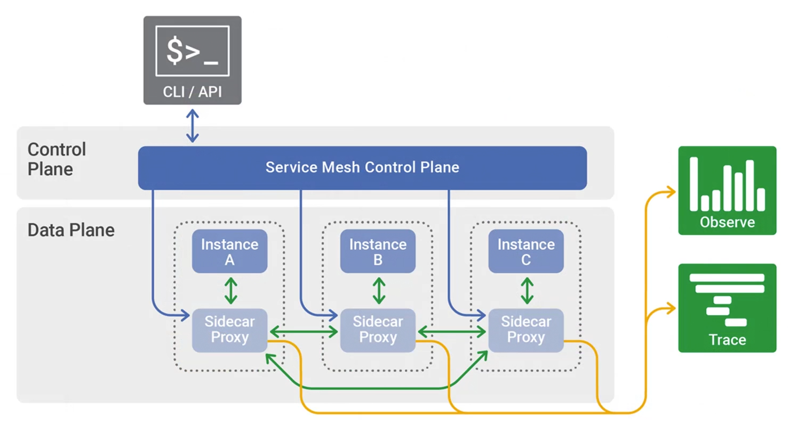

### 📦 Exemplos Reais

#### 🔷 Service Mesh (Istio / Linkerd)

Cada serviço tem um sidecar proxy (ex: Envoy).

#### Ele cuida de:
- 🔐 mTLS
- 🔁 Retry
- 🔌 Circuit Breaker
- 🔍 Observabilidade

A aplicação nem sabe que isso está acontecendo.

#### 🔷 Logging

#### Sidecar coleta logs e envia para:
- Elasticsearch
- Datadog
- Loki

#### 🔷 Monitoramento

#### Sidecar expõe métricas para:
- Prometheus

### 🎯 Benefícios

- Separação de responsabilidades
- Padronização entre serviços
- Menos código repetido
- Atualização independente
- Maior controle de infraestrutura

### ⚠️ Pontos de Atenção

- Aumenta consumo de recursos
- Pode aumentar latência
- Mais complexidade operacional

### 🛒 Exemplo no seu e-commerce

#### Serviço de Pedido:
- Container 1 → API de Pedido
- Container 2 → Sidecar Envoy

#### O sidecar pode:
- 🚦 Aplicar rate limit
- 🔁 Fazer retry
- 🔗 Registrar tracing
- 🔐 Aplicar mTLS

Tudo sem alterar o código da API.

### 📝 Resumo

#### O Sidecar Pattern:

> Move responsabilidades técnicas e transversais para um componente auxiliar ao lado da aplicação.

#### Muito comum em:
- Kubernetes
- Service Mesh
- Arquiteturas Cloud Native

### 📡 Telemetria

**Telemetria** é o **processo de coletar dados automaticamente de um sistema** para monitoramento e análise.

Ela é a base da observabilidade.

   

#### Inclui:
- 📜 Logs
- 📊 Métricas
- 🔗 Tracing
- 🔔 Eventos
- 🖥 Dados de infraestrutura (CPU, memória, rede)

#### 🎯 Objetivo

- Entender comportamento do sistema
- Detectar falhas rapidamente
- Apoiar decisões baseadas em dados
- Medir desempenho real

#### 🛒 Exemplo no e-commerce

#### 📦 Você coleta:
- Tempo médio de processamento de pedido
- Taxa de erro do pagamento
- Uso de CPU dos pods
- Latência entre serviços
Esses dados formam sua telemetria.

#### 🔧 Ferramentas comuns:
- OpenTelemetry
- Prometheus
- Grafana
- Application Insights

### 🚀 APM (Application Performance Monitoring)

**APM** é uma **categoria de ferramentas que utiliza telemetria para monitorar performance da aplicação.**

> Se **telemetria** é o **dado bruto**,
> **APM** é a **inteligência** aplicada sobre ele.

   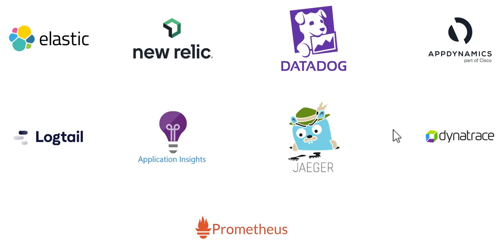

#### 🎯 O que o APM monitora?
- Tempo de resposta 
- Dependências externas
- Banco de dados
- Erros
- Gargalos
- Tracing distribuído

#### 📊 O que um APM entrega
- Dashboard de performance
- Alertas automáticos
- Mapa de dependências
- Análise de gargalos
- Visualização de traces

#### 🛠️ Ferramentas APM
- Datadog
- New Relic
- Dynatrace
- Azure Application Insights
- Elastic

#### 🧩 Diferença resumida
| Telemetria              | APM                |
| ----------------------- | ------------------ |
| Coleta dados            | Analisa dados      |
| Base técnica            | Produto/ferramenta |
| Logs, métricas e traces | Insights e alertas |

#### 🛒 Exemplo prático

#### Sem APM:
- Usuário reclama que o checkout está lento
- Você começa a investigar manualmente

#### Com APM:
- Dashboard mostra que 80% do tempo está no serviço de pagamento
- Trace mostra latência alta no banco
- Alerta já foi disparado

#### 📝 Resumo
- **📡 Telemetria →** Coleta dados do sistema
- **🚀 APM →** Usa esses dados para monitorar performance e detectar problemas

#### Em microsserviços:
- Telemetria é obrigatória.
- APM é o acelerador de maturidade operacional.

### 🚀 SRE (Site Reliability Engineering)

**SRE** é uma abordagem criada pelo Google que aplica **princípios de engenharia de software para resolver problemas de operações e confiabilidade.**

É uma disciplina dentro da engenharia de software que visa criar e manter sistemas de software altamente confáveis e escaláveis.

#### Em vez de apenas “operar sistemas”, o SRE:
> Automatiza, mede, melhora e trata infraestrutura como código.

### 🎯 Objetivo do SRE

Garantir que sistemas:
- 🟢 Estejam disponíveis
- 🛡️ Sejam resilientes
- 📈 Escalem corretamente
- 📊 Tenham previsibilidade operacional

### 🧠 Conceitos Fundamentais
### 📊 SLA, SLO e SLI

#### 🔷 SLI (Service Level Indicator)
Métrica que mede algo importante.

#### 📌 Exemplo:
- Latência
- Taxa de erro
- Disponibilidade

#### 🔷 SLO (Service Level Objective)
Meta desejada para o SLI.

#### 📌 Exemplo:
- 99.9% de disponibilidade
- 95% das requisições < 200ms

#### 🔷 SLA (Service Level Agreement)
Contrato formal com o cliente.

#### 📌 Exemplo:
- 99.5% garantido em contrato

#### 💰 Error Budget
É o quanto você pode “errar” sem violar o SLO.

#### 📌 Exemplo:
- SLO = 99.9%
- → Pode ter 0.1% de erro

Se consumir todo o error budget:

🚫 Para deploy
🔧 Foca em estabilidade

#### Isso cria equilíbrio entre:
- Inovação 🚀
- Confiabilidade 🛡️

### 🛠️ Práticas do SRE

#### 🔁 Automação
- Deploy automatizado
- Infraestrutura como código
- Auto scaling
- Self-healing

#### 📊 Observabilidade

#### Baseada em:
- Logs 📜
- Métricas 📈
- Tracing 🔗

Sem métricas, não existe SRE.

#### 🌪️ Chaos Engineering
Testar falhas intencionalmente para validar resiliência.

#### 🧯 Gestão de Incidentes
- Runbooks
- Post-mortem sem culpa
- Análise de causa raiz (RCA)

#### 🧑🏼‍🤝‍🧑🏾 Cultura SRE

SRE não é só técnica é **cultura**:

- Blameless postmortem
- Métricas guiam decisões
- Reduzir trabalho manual repetitivo
- Engenharia acima de operação manual

#### 🏗️ SRE vs DevOps
| DevOps                | SRE                                         |
| --------------------- | ------------------------------------------- |
| Cultura e colaboração | Implementação prática dessa cultura         |
| Integra Dev + Ops     | Usa engenharia para garantir confiabilidade |
| Foco em entrega       | Foco em confiabilidade com métricas         |

#### 🛒 Exemplo de e-commerce

#### SRE definiria:

- SLO de 99.9% para API de Pedido
- Alerta se taxa de erro > 1%
- Error budget controla deploy
- Auto scaling baseado em tráfego
- Post-mortem se pagamento falhar

### 📝 Resumo

#### SRE é:
> **Engeharia** aplicada à **confiabilidade do sistema.**

#### Ele equilibra:
- 🚀 Velocidade de entrega
- 🛡️ Estabilidade
- 📊 Métricas reais

#### 📍 O que é

#### 📌 Exemplo:

#### 🧠 Como funciona

#### 📝 Resumo

#### ⚠️ Cuidados

#### 🎯 Objetivo

#### 📊 Benefícios

#### 📍 Onde aplicar

#### ✅ Vantagens

#### ❌ Desvantagens

📦

📋

🤔